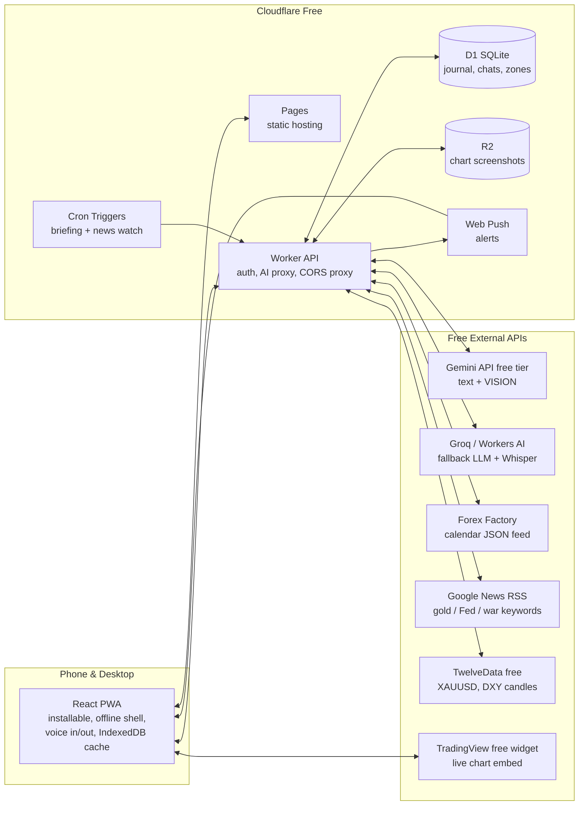

# Trading Companion — Development Plan

A personal AI trading buddy + mentor for a discretionary XAUUSD price-action day trader.
Built entirely on free tiers. Runs as a website **and** an installable mobile app (PWA) on your name.com domain.

---

## 1. The Problem It Solves

You already have the technical skills (BOS, break & retest, S/R zones, double top/bottom entries).
What's costing you money is **execution**, not analysis. So the app is designed around four jobs:

| Your pain | The buddy's job |
|---|---|
| No one to bounce ideas off | **Setup Analyzer** — critiques your chart + idea like an honest trader friend |
| Overtrading, fear, greed, revenge | **Psychology Coach** — check-ins, circuit breakers, de-tilt chats, discipline score |
| Journaling feels like work | **Zero-friction Journal** — one tap from an analyzed setup, voice notes, auto-stats |
| No fundamentals routine | **Daily Briefing + News Watch** — Forex Factory calendar, gold/USD/geopolitics news, daily bias |
| Risk math per trade | **Risk Guard** — instant XAUUSD lot sizing, enforced against YOUR rules |

**Product principle:** the buddy rewards *discipline*, never profits. It is a decision-support tool and coach — not a signal service. It will happily talk you *out* of trades (that's the point).

---

## 2. Product Identity

- **Name (decided):** **TradeMate** — the buddy goes by **"Mate"**.
- **Buddy persona ("Mate"):** warm, direct, occasionally funny, never a yes-man. Challenges weak setups, celebrates skipped C-grade trades, remembers your patterns ("this looks like the revenge entry from Tuesday...").
- **Avatar states** in the UI: idle / thinking / concerned / proud — reacts to what's happening.

---

## 3. Zero-Cost Architecture

### Stack choices & why

| Layer | Choice | Why |
|---|---|---|
| Frontend | **React + Vite + TypeScript + Tailwind + Framer Motion** | Fast, beautiful, animation-rich; PWA via `vite-plugin-pwa` |
| Charts | **Lightweight Charts** (open-source, by TradingView) + TradingView embed widget | Draw YOUR zones + mark journal trades on real candles; widget for full live analysis |
| Local data | **Dexie (IndexedDB)** — local-first, syncs in background | Instant UI, works offline on the go |
| Hosting | **Cloudflare Pages** (free, unlimited static requests) | Custom domain + SSL free |
| Backend | **Cloudflare Worker** (100k req/day free) | Holds API keys secretly, proxies CORS-blocked feeds, single-user JWT auth |
| Database | **Cloudflare D1** (5 GB, 100k writes/day free) | Journal, chats, zones, briefings — enormous headroom for one user |
| Screenshots | **Cloudflare R2** (10 GB free, zero egress fees) | Years of chart screenshots |
| Scheduled jobs | **Cloudflare Cron Triggers** (free) | Pre-market briefing, news scans, weekly coach report |
| Primary AI | **Google Gemini Flash — free API key** | Multimodal: reads your chart screenshots. Free quota (hundreds of requests/day) ≫ one trader's usage |
| Fallback AI | **Groq free tier** and/or **Cloudflare Workers AI** (10k neurons/day) | If Gemini rate-limits mid-session; Workers AI Whisper = free voice transcription fallback |
| Voice | **Web Speech API** (built into browser, $0) | Talk to the buddy; TTS replies via `speechSynthesis` |
| Push alerts | **Web Push (VAPID)** — standard, free | Red-news countdowns, breaking headlines, circuit-breaker nudges |

### Free data sources

| Data | Source | Notes |
|---|---|---|
| Economic calendar | Forex Factory weekly JSON feed (`nfs.faireconomy.media/ff_calendar_thisweek.json`) | Impact ratings included; fetched by Worker (avoids CORS) |
| Breaking news / geopolitics | Google News RSS keyword feeds (gold, Fed, war, CPI, FOMC…) — no key needed | Worker prefilters by keyword, LLM classifies severity |
| Extra headlines w/ sentiment | Finnhub free / Alpha Vantage news-sentiment / GNews free tiers | Optional layers, all keyed & free |
| XAUUSD / DXY / yields prices | TwelveData (800 credits/day free); Yahoo Finance unofficial endpoints as backup | Enough for candles + daily snapshots |
| Live chart | TradingView embed widget (OANDA:XAUUSD) | Completely free, professional look |

**Monthly cost: $0.** Only thing you already own: the name.com domain.

**Domain setup (decided):** point the name.com domain's nameservers to Cloudflare (free plan) → app + API served from your domain with automatic SSL. In the name.com dashboard: Domain → Nameservers → replace with the two Cloudflare nameservers shown when you add the site to Cloudflare.

---

## 4. Feature Specifications

### 4.1 Setup Analyzer — "Hey, look at this setup"
The centerpiece. Flow:

1. **Capture:** upload/paste 1–3 chart screenshots (HTF context + entry TF encouraged).
2. **Quick form** (all optional, voice-dictatable): direction, setup type (BOS / break & retest / S zone / R zone / double top / double bottom), entry, SL, TP, timeframe, session.
3. **Buddy's verdict card** (Gemini Vision, structured output):
   - **Grade: A / B / C** with one honest headline sentence
   - **Confluence checklist** ✓/✗ — HTF trend alignment, zone quality (touches/freshness), clean structure break vs. liquidity wick, entry trigger quality (is that actually a double bottom?), R:R vs. your plan minimum, **news window clear?** (cross-checked against today's FF calendar — auto-warns "CPI in 40 min")
   - **What I like / What worries me** — plain talk, like a friend
   - **Alternative idea** if it sees a better play on the same chart
   - **Risk plan** — auto lot size from the Risk Guard
4. **Two buttons:**
   - **"I'm taking it"** → journal trade pre-created, zero extra work
   - **"Skipping it"** → logs the skip **and awards discipline XP** (skipping a C-grade setup literally scores points — anti-overtrading by design)
5. Later: "How did that XAUUSD short go?" prompt → outcome + exit screenshot + emotion tags → loop closed.

### 4.2 Risk Guard
- XAUUSD sizing: `lots = risk$ / (stopDistance$ × 100)` (1 lot = 100 oz; 1 pip = $0.10). With **your numbers**: $10k eval, 0.5% risk = $50, 50-pip ($5) stop → **0.10 lots**; 1% risk, 100-pip stop → 0.10 lots.
- Your rules stored in profile: 0.5–1% risk/trade, typical SL 50–100 pips, **hard cap 2 trades/day**, no-trade windows (red news ± X min).
- **Prop-firm guard (Alpha Capital, actual numbers):** daily loss limit **$500**, max drawdown **$1,000**, profit target **$1,000 (phase 1) → $500 (phase 2)**. Live progress bars against each; warnings as you *approach* limits ("$180 of today's $500 used — one more 1R loss is fine, two is not"). Switches cleanly to a personal-account profile later.
- **News-window rule:** the firm requires being flat ±5 min around red news when funded; relaxed on evals. TradeMate shows the countdown either way and hard-warns when the restriction applies — good discipline and zero surprises at funding.
- The buddy **refuses to bless** any setup that violates your own rules — and says why.

### 4.3 Zero-Friction Journal (the anti-Notion)
- Entries are 90% auto-created from analyzed setups. Manual entry = 20 seconds.
- **Voice reflections**: hold mic, ramble, Web Speech API transcribes; buddy files it.
- **One-tap emotion chips**: FOMO · revenge · hesitation · confident · anxious · bored.
- Before/after screenshots straight to R2.
- **Auto-stats**: R-based equity curve, win rate by setup type / session / emotion / day-of-week, average R, overtrading heatmap (trades/day vs. your rule).
- **Weekly Coach Report** (Sunday cron): the buddy reads your week and writes a report — "3 of your 4 losses came within 10 minutes of a prior loss. That's revenge trading. This week's single focus: 15-minute cooldown after any loss."

### 4.4 Psychology Coach
- **Pre-session check-in** (30 sec): mood slider + sleep + "what's your plan today?" → buddy tailors its tone for the day.
- **Circuit breaker** (configurable): 2 consecutive losses or daily loss limit hit → app enters cooldown mode: full-screen intervention, buddy chat, soft lockout timer, journaling prompt. It can't close your broker app — but it makes tilt *loud and visible*.
- **De-tilt chat mode**: after a stop-out, a dedicated "vent" conversation with a coach persona (validate → analyze → reframe → plan).
- **Discipline Score & streaks**: XP for rule-following (journaled every trade, respected max trades, skipped bad setups, did check-in). Streak flame. Weekly level. *Zero XP for profits* — process only.

### 4.5 Daily Briefing (pre-market, auto-generated)
Cron before your session (default: before London open, configurable to your timezone). Worker gathers:
- Today's FF calendar (USD + high-impact), with countdown timers
- Overnight headlines (gold, Fed, DXY, geopolitics/war)
- Price snapshot: XAUUSD / DXY / US 10Y — overnight range, key swing levels
- Your saved zones near current price
- **Market regime meter** — computed from recent candles (trending vs. choppy: range overlap, ATR compression). Right now gold is choppy — zones get tested multiple times before the real move — so Mate downgrades first-touch entries and favors your confirmation triggers (double top/bottom) until the regime shifts.

→ Gemini writes a structured briefing: **macro narrative · sentiment read · directional bias with confidence % · invalidation level · "today's landmines" (news times) · which of YOUR zones matter today.** Cached in D1 — opens instantly, works offline once loaded. Push notification: "☀️ Your XAUUSD briefing is ready."

### 4.6 Live News Watch
- Worker cron every ~20 min during market hours scans RSS for high-impact keywords (war, missile, strikes, emergency, Fed, tariff…).
- **Trump / Truth Social watch (priority source):** his posts ("we bombed Iran", "the strait is open") move gold faster than any calendar event. Free options, in order: Truth Social archive mirrors with RSS (e.g. trumpstruth.org), Roll Call FactBase, and Google News RSS on his name + market keywords (Iran, Hormuz, strait, tariff, Fed, Powell, China) as the always-works fallback. Scanned on a tighter interval than general news; matches push instantly with a gold-impact read.
- Keyword prefilter first (cheap), LLM severity check only on hits (protects AI quota).
- High severity → instant push: "⚠️ Headline: … — likely gold-positive. You have an open long? Consider protecting it."

### 4.7 Buddy Chat (talk about anything)
- Persistent conversation, full memory context: your **Trader Profile** + last N journal entries + today's briefing + open trades.
- **Voice in** (Web Speech API; Whisper on Workers AI as fallback), **voice out** (speechSynthesis, toggleable).
- Personality guardrails: honest, specific, challenges you, no sycophancy, no invented prices (all numbers come from injected real data — if a feed failed, it says so).

### 4.8 Zones & Chart
- Save your S/R zones / levels with notes ("H4 demand, 3 touches").
- Rendered on a Lightweight Charts candle view with live TwelveData candles; journal trades plotted as markers → **visual trade replay**.
- Client-side proximity alerts while app is open ("price entering your 2,412 zone").
- TradingView widget tab for full-featured live charting.

---

## 5. The Buddy's Brain

- **Trader Profile document** (D1, editable): your playbook rules, known weaknesses (overtrading, fear, greed), account size, risk rules, goals. Injected into every AI call → the buddy always "knows you."
- **Self-updating with consent:** the weekly coach can propose profile updates ("add weakness: exits early on winners?") — you approve/reject.
- **Playbook encoding:** your exact setups (BOS, B&R, S/R, double top/bottom) defined as explicit checklists in the system prompt → grading is consistent, not vibes.
- **Regime-aware grading:** the current market regime (choppy vs. trending, from the briefing engine + your own observations) is part of every setup review — in chop, first-touch zone entries get penalized and "expect a retest" becomes the default assumption.
- **Structured outputs** (JSON schema) for verdict cards, briefings, and severity checks → reliable UI rendering.
- **Fallback chain:** Gemini → Groq → Workers AI. Rate-limit or outage never bricks your session.

---

## 6. Data Model (D1)

`profile` (single row: rules, weaknesses, sessions, risk config, prop-firm limits) · `setups` (analysis requests + AI verdicts + screenshot refs) · `trades` (entry/exit, R, outcome, emotions[], setup_id) · `journal_notes` (text/voice reflections) · `checkins` (mood, sleep, plan) · `zones` (price ranges, timeframe, notes, active) · `briefings` (date, JSON content) · `news_events` (headline, severity, pushed_at) · `chat_messages` (role, content, thread) · `discipline_log` (XP events, streaks) · `push_subscriptions`.

Local mirror of hot tables in IndexedDB; background sync; last-write-wins (single user).

---

## 7. UI / UX Direction

**Aesthetic:** dark trading-desk theme, gold (#E8B84B-ish) accent, glassmorphism cards, subtle grain, Framer Motion micro-interactions. Feels like a premium fintech app, not a form.

**Screens (bottom tab bar on mobile, sidebar on desktop):**

1. **Today** — briefing card (expandable), red-news countdown chips, discipline ring, mood check-in, session clock (Asia/London/NY in your local UTC+3 time), **your 2 daily trade tokens** (each trade spends one — when they're gone, Mate holds you to your rule), quick actions ("Analyze a setup" / "Talk to Mate").
2. **Analyze** — camera-first setup analyzer; verdict card with animated grade reveal.
3. **Chat** — buddy conversation, mic button with waveform animation, avatar reacting.
4. **Journal** — calendar heatmap (green/red by R), timeline, tap-in details, weekly report cards.
5. **Stats** — equity curve, win-rate breakdowns, emotion-vs-outcome matrix, overtrading heatmap.
6. **Zones** — candle chart with your levels; add-zone by tap-drag.
7. **Settings** — risk rules, circuit breaker, API keys, notifications, voice, data export (JSON/CSV — your data is yours).

**Engagement mechanics:** streak flame, XP level-ups with confetti (for discipline only), buddy avatar moods, countdown timers, haptics on mobile.

---

## 8. Build Phases

| Phase | Deliverable | You get |
|---|---|---|
| **0. Foundations** | Cloudflare account, name.com NS → Cloudflare, Gemini/Groq/TwelveData free keys, repo scaffold (Vite PWA + Worker + D1 schema), passcode auth | Live "hello" app on your domain |
| **1. Risk Guard + Journal core** | Calculator, trade CRUD, emotion chips, local-first sync, basic stats | Immediately usable daily tool |
| **2. The Buddy** | Chat with profile memory, Setup Analyzer with vision + verdict cards + take/skip flow | The trading friend exists |
| **3. Fundamentals engine** | FF calendar ingest, daily briefing cron + push, live news watch | Wake up to your gold briefing |
| **4. Psychology layer** | Check-ins, circuit breaker, de-tilt mode, discipline XP/streaks, weekly coach report | The mentor exists |
| **5. Zones & charts** | Lightweight Charts + zones + trade replay + TradingView tab | Visual command center |
| **6. Polish** | Voice in/out everywhere, animations, avatar states, offline hardening, install flows (Android + iOS) | The premium feel |

Each phase ships something usable — you start journaling with it from Phase 1 while the rest is built.

---

## 9. Free-Tier Limits & Honest Risks

| Risk | Reality / Mitigation |
|---|---|
| Gemini free quota (order of a few hundred requests/day) | You're one user; a heavy day ≈ 30–60 calls. Fallback chain covers spikes. |
| FF feed / Yahoo endpoints are unofficial | Worker abstracts sources; multiple backups per data type; buddy admits when data is missing. |
| iOS push requires the PWA to be installed (Add to Home Screen) | One-time install; Android is frictionless. |
| Web Speech API best on Chrome/Android | Whisper via Workers AI free tier as fallback recorder path. |
| Cloudflare free Worker = 10 ms CPU/request | Plenty — our work is I/O (API waits don't count against CPU). |
| AI predictions can be wrong | Briefings show confidence + invalidation; the app's core value is *discipline*, which doesn't depend on prediction accuracy. |

---

## 10. Decisions (Resolved 2026-07-13)

1. **Name:** TradeMate; the buddy is "Mate".
2. **Domain:** name.com domain → nameservers switched to Cloudflare free. ✅
3. **Profile defaults:**
   - Timezone **UTC+3** (Addis Ababa). Sessions: **NY is primary** (good moves after ~15:30 local), London mornings when opportunities show, occasional early-morning Asian (~4am wake-ups).
   - Account: **Alpha Capital Group $10k eval** now; personal account planned later → app supports switching account profiles.
   - Risk **0.5–1% per trade**, SL typically **50–100 pips**, **max 2 trades/day win or lose** — the rule you struggle to keep, so the circuit breaker + trade tokens are built around it.
4. **Alpha Capital rules (received 2026-07-14):** daily loss $500 · max drawdown $1,000 · targets $1,000 (P1) / $500 (P2) · flat ±5 min around red news when funded (relaxed on eval). Wired into the profile schema and Prop Guard.
5. **Still needed when wiring later phases:** free-account keys (Cloudflare, Google AI Studio, Groq, TwelveData).
