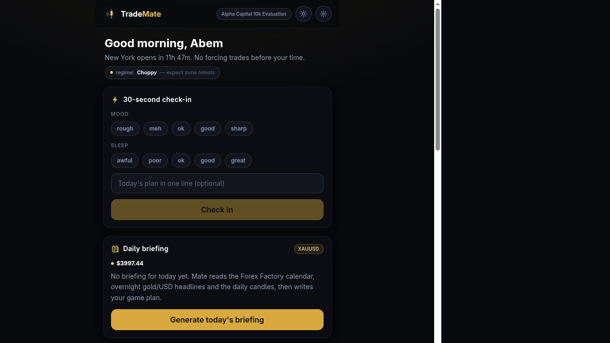
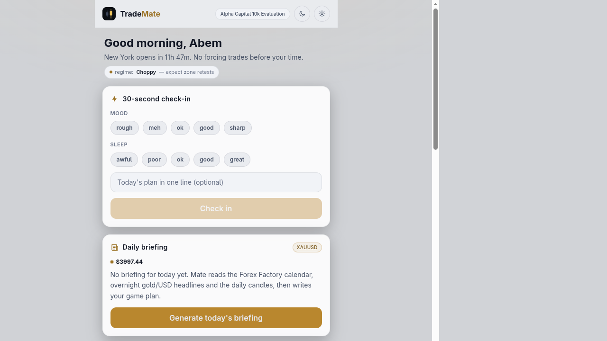
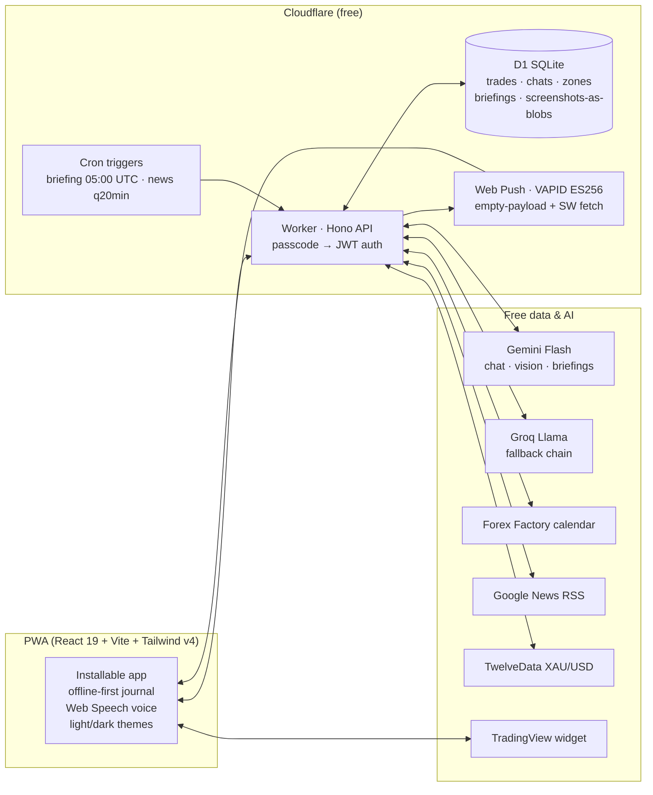

# TradeMate

**An AI trading companion for a discretionary XAUUSD price-action day trader — buddy, mentor, journal and risk guard in one installable app. Built for $0/month on free tiers.**

<p align="center">
  
  
</p>

## Why

Most trading apps give you charts. Almost none fix the actual problem: **execution**. Overtrading, revenge entries, skipped journaling, position sizes picked by feel. TradeMate is a personal companion ("Mate") that knows the trader's playbook, rules and history — and holds the line when discipline slips.

## What it does

| Pillar | Details |
|---|---|
| **Setup Analyzer** | Upload chart screenshots — AI vision grades the setup A/B/C against the trader's own playbook (BOS, break & retest, S/R zones, double top/bottom), with a confluence checklist, honest concerns and a better alternative when it sees one. "Taking it" pre-fills the journal; "skipping it" earns discipline XP. |
| **Mate (chat)** | An AI buddy with full context: rules, prop-firm limits, saved zones, recent trades, today's check-in. Voice in/out. De-tilts after losses, refuses to bless rule-breaking trades. Chat history grouped by day. |
| **Zero-friction journal** | Log a trade in ~20 seconds: direction, setup chips, risk % + SL slider → auto lot size, R-multiple quick buttons, emotion tags, screenshots (auto-compressed). Offline-first with background sync. |
| **Daily briefing** | Cron-generated pre-session game plan: Forex Factory calendar, overnight gold/USD/geopolitics headlines, live candles → bias + confidence, key levels, invalidation, "today's landmines" with countdowns. Live price ticker refreshes every ~45 s. |
| **News watch** | Server scans headlines every 20 minutes (Trump/Iran/Fed/tariff keyword prefilter → AI severity + gold-impact classification). High-severity news triggers real Web Push — with the app fully closed. |
| **Risk & Prop Guard** | XAUUSD position sizing, hard cap on trades/day (visualized as spendable tokens), live bars against prop-firm limits (daily loss / max drawdown / profit target), circuit breaker after consecutive losses. |
| **Stats that coach** | Calendar heatmap with day popups, equity curve, monthly progress, win rate by setup/session, emotion-vs-results analysis, discipline XP (earned for process, never for profits), AI weekly review that names the week's behavioral pattern. |

## Architecture

Everything runs on free tiers — the only cost is a domain.



**Engineering notes**

- **Single Worker** serves the static PWA and the API (`run_worker_first` on `/api/*`), deploys in seconds.
- **AI provider chain** with graceful fallback (Gemini → Groq), strict-JSON contracts, balanced-brace parsing, truncation detection and one-shot retry.
- **Web Push without RFC 8291 encryption**: pushes are sent payload-free; the service worker fetches `/api/push/latest` (cookie-authed) to compose the notification. VAPID JWTs are signed with WebCrypto ES256 inside the Worker.
- **Screenshots as D1 blobs** — client-side canvas compression to ~150 KB WebP keeps years of chart history inside the free 5 GB, with no R2/billing requirement.
- **Offline-first journal**: localStorage write queue + cache, idempotent bulk upserts with last-write-wins, auto-flush on reconnect.
- **Theming** via CSS custom-property re-mapping (`[data-theme="light"]`), so every component follows without code changes.

## Stack

React 19 · TypeScript · Vite · Tailwind CSS v4 · Zustand · Hono · Cloudflare Workers + D1 · Workbox (injectManifest PWA) · Gemini / Groq / TwelveData / Forex Factory / Google News (all free tiers)

## Run it

```bash
cd trademate
cp .dev.vars.example .dev.vars   # add your free API keys
npm install
npm run db:migrate:local
npm run dev
```

Deployment steps: [trademate/README.md](trademate/README.md). Product plan and design decisions: [PLAN.md](PLAN.md).

## Disclaimer

TradeMate is a personal decision-support and journaling tool. Nothing it produces is financial advice; AI-generated market commentary can be wrong. The app's real value is enforcing *your own* rules.

## License

[MIT](LICENSE) © Abem Tadele
